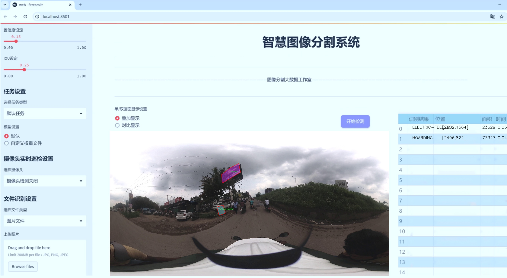
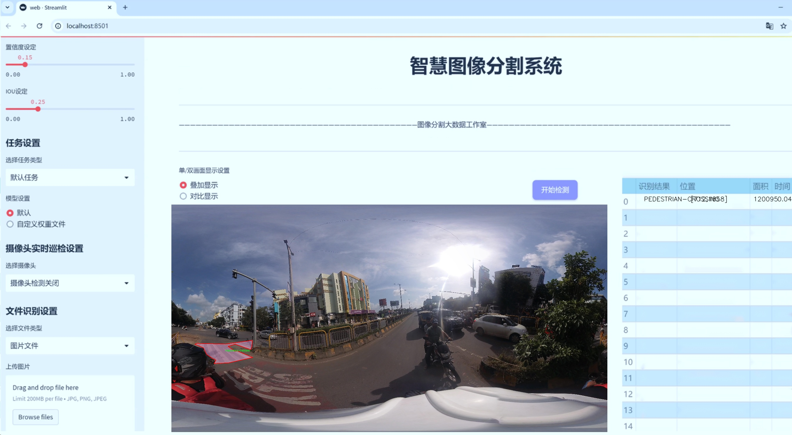
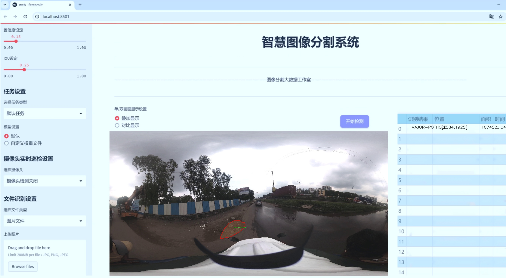
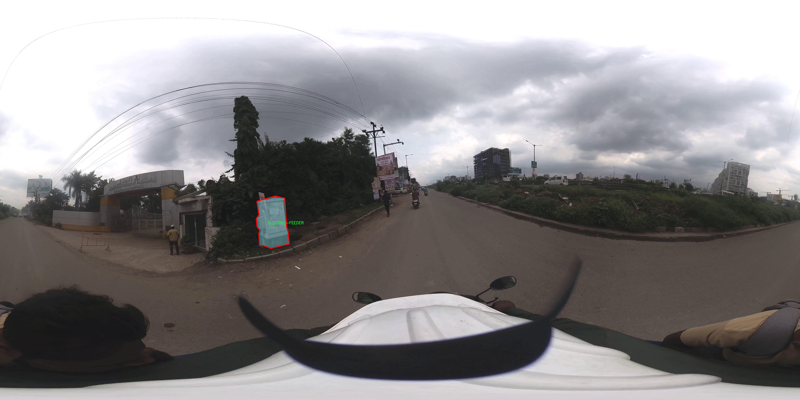
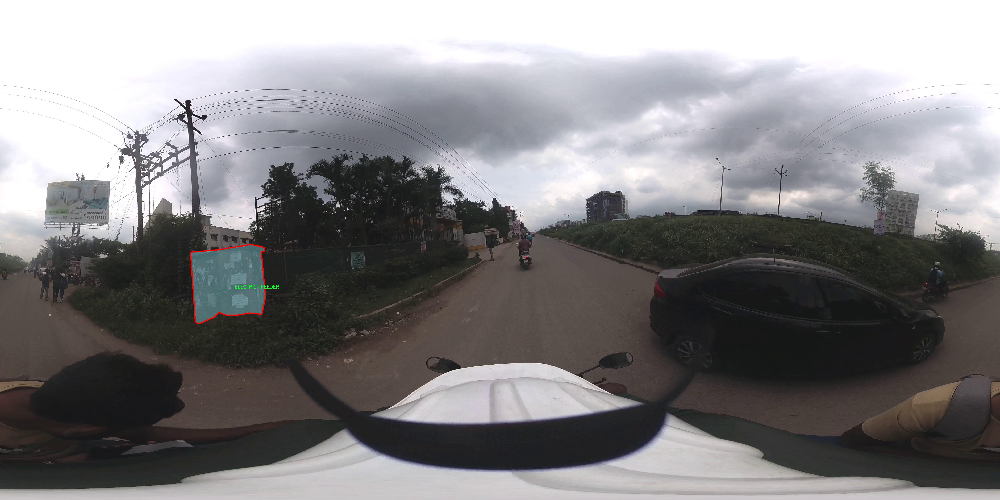
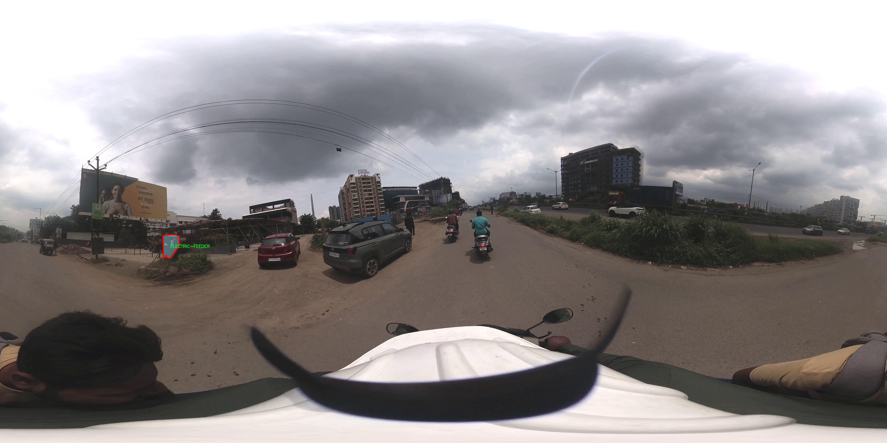
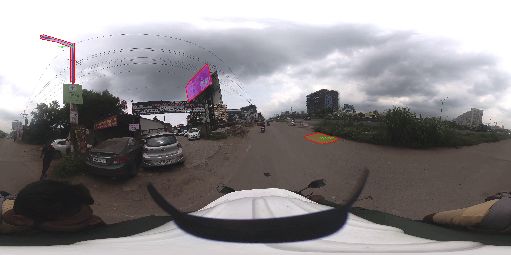
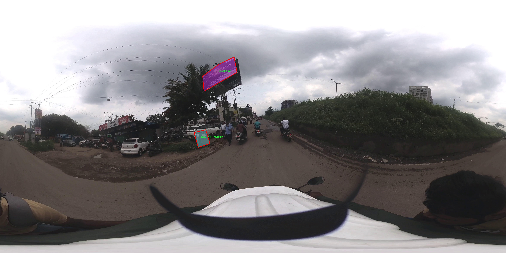

# 城市交通设施道路坑洞裂纹警示桩等图像分割系统源码＆数据集分享
 [yolov8-seg-fasternet＆yolov8-seg-C2f-EMBC等50+全套改进创新点发刊_一键训练教程_Web前端展示]

### 1.研究背景与意义

项目参考[ILSVRC ImageNet Large Scale Visual Recognition Challenge](https://gitee.com/YOLOv8_YOLOv11_Segmentation_Studio/projects)

项目来源[AAAI Global Al lnnovation Contest](https://kdocs.cn/l/cszuIiCKVNis)

研究背景与意义

随着城市化进程的加快，城市交通设施的管理与维护日益成为保障城市交通安全与效率的重要课题。道路坑洞、裂纹等问题不仅影响了城市的美观，更对行车安全构成了严重威胁。根据相关统计数据，因道路损坏导致的交通事故频发，给社会带来了巨大的经济损失和人身伤害。因此，及时、准确地识别和处理道路设施的损坏情况，成为了城市交通管理部门亟待解决的问题。

在此背景下，图像分割技术的应用逐渐引起了研究者和工程师的关注。图像分割技术能够将图像中的不同区域进行有效分离，提取出特定的目标信息。尤其是在城市交通设施的监测与维护中，利用先进的图像分割算法，可以实现对道路坑洞、裂纹等问题的自动识别与定位，从而提高维护工作的效率和准确性。近年来，YOLO（You Only Look Once）系列算法因其高效的实时检测能力而受到广泛应用。YOLOv8作为该系列的最新版本，具备了更强的特征提取能力和更高的检测精度，为城市交通设施的图像分割提供了新的技术支持。

本研究旨在基于改进的YOLOv8算法，构建一个针对城市交通设施的图像分割系统，重点关注道路坑洞、裂纹等问题的自动识别与警示。我们使用的数据集包含4500张图像，涵盖22个类别，包括公交站、警示标志、监控摄像头、裂纹、主要坑洞等多种交通设施。这些类别的多样性为系统的训练提供了丰富的样本，使得模型能够在不同场景下进行有效的识别与分割。

通过对该系统的研究与开发，我们希望能够实现以下几个目标：首先，提高道路设施损坏的检测精度，减少漏检和误检的情况；其次，优化检测速度，使得系统能够在实际应用中实现实时监测；最后，提供可视化的警示信息，帮助交通管理部门及时采取措施，保障交通安全。

此外，本研究的意义不仅在于技术层面的创新，更在于推动城市交通管理的智能化进程。随着智能交通系统的不断发展，基于图像分割的自动监测技术将为城市交通管理提供更为科学和高效的解决方案。通过对交通设施的实时监测与维护，能够有效降低交通事故的发生率，提高城市交通的整体运行效率，进而提升市民的出行安全与便利性。

综上所述，基于改进YOLOv8的城市交通设施道路坑洞裂纹警示桩等图像分割系统的研究，不仅具有重要的理论价值，更具备广泛的实际应用前景。我们期待通过本研究的深入推进，为城市交通管理的智能化发展贡献一份力量。

### 2.图片演示







##### 注意：由于此博客编辑较早，上面“2.图片演示”和“3.视频演示”展示的系统图片或者视频可能为老版本，新版本在老版本的基础上升级如下：（实际效果以升级的新版本为准）

  （1）适配了YOLOV8的“目标检测”模型和“实例分割”模型，通过加载相应的权重（.pt）文件即可自适应加载模型。

  （2）支持“图片识别”、“视频识别”、“摄像头实时识别”三种识别模式。

  （3）支持“图片识别”、“视频识别”、“摄像头实时识别”三种识别结果保存导出，解决手动导出（容易卡顿出现爆内存）存在的问题，识别完自动保存结果并导出到tempDir中。

  （4）支持Web前端系统中的标题、背景图等自定义修改，后面提供修改教程。

  另外本项目提供训练的数据集和训练教程,暂不提供权重文件（best.pt）,需要您按照教程进行训练后实现图片演示和Web前端界面演示的效果。

### 3.视频演示

[3.1 视频演示](https://www.bilibili.com/video/BV1pd2oYREVx/)

### 4.数据集信息展示

##### 4.1 本项目数据集详细数据（类别数＆类别名）

nc: 22
names: ['BUS-STOP', 'CAUTIONARY-SIGN', 'CCTV', 'CRACK', 'ELECTRIC-FEEDER', 'EXPANSION-JOINT', 'GANTRY-BOARD', 'HOARDING', 'HOTSPOT', 'INFORMATORY-SIGN', 'MAJOR-POTHOLE', 'MANDATORY-SIGN', 'MANHOLE', 'MINOR-POTHOLE', 'PEDESTRIAN-CROSSING', 'PETROL-PUMP', 'RAVELLING', 'ROAD-PATCH', 'RUMBLING-STRIP', 'STREET-LIGHT', 'TRAFFIC-LIGHT', 'TREES']


##### 4.2 本项目数据集信息介绍

数据集信息展示

在现代城市交通管理中，图像分割技术的应用愈发重要，尤其是在识别和处理道路坑洞、裂纹及交通设施等方面。为此，本研究采用了名为“test-rastaproject-data”的数据集，旨在训练和改进YOLOv8-seg模型，以实现对城市交通设施的高效图像分割。该数据集包含22个类别，涵盖了城市道路中常见的交通设施及其相关问题，为模型的训练提供了丰富的样本和多样化的场景。

数据集中包含的类别包括：公交站（BUS-STOP）、警告标志（CAUTIONARY-SIGN）、闭路电视（CCTV）、裂纹（CRACK）、电源线（ELECTRIC-FEEDER）、伸缩缝（EXPANSION-JOINT）、跨线桥标志（GANTRY-BOARD）、围挡（HOARDING）、热点区域（HOTSPOT）、信息标志（INFORMATORY-SIGN）、重大坑洞（MAJOR-POTHOLE）、强制标志（MANDATORY-SIGN）、人孔（MANHOLE）、小型坑洞（MINOR-POTHOLE）、人行横道（PEDESTRIAN-CROSSING）、加油站（PETROL-PUMP）、路面剥落（RAVELLING）、路面修补（ROAD-PATCH）、隆起带（RUMBLING-STRIP）、路灯（STREET-LIGHT）、交通信号灯（TRAFFIC-LIGHT）以及树木（TREES）。这些类别不仅涵盖了道路安全和交通流量管理的关键元素，还包括了对道路状况的监测与维护。

在数据集的构建过程中，考虑到了多样性和复杂性，以确保模型在不同环境和条件下的鲁棒性。每个类别的图像均经过精心标注，确保准确性和一致性，这对于后续的模型训练至关重要。通过对这些类别的细致划分，研究者能够更好地理解和分析城市交通设施的现状，进而提出相应的改进措施。

该数据集的设计不仅注重了视觉信息的丰富性，还考虑到了实际应用中的需求。例如，公交站和人行横道的标注能够帮助模型在城市环境中识别出重要的交通节点，而裂纹和坑洞的标注则为道路维护提供了必要的数据支持。通过对这些关键元素的识别与分割，能够有效提升城市交通管理的智能化水平，减少交通事故的发生，提升行车安全。

在训练YOLOv8-seg模型的过程中，数据集的多样性将使得模型能够学习到更为复杂的特征，增强其在实际应用中的表现。模型将通过对不同类别的图像进行训练，逐步提高其对交通设施及道路状况的识别能力。这不仅有助于提升交通管理的效率，还能够为城市规划和基础设施建设提供重要的数据支持。

综上所述，“test-rastaproject-data”数据集为改进YOLOv8-seg的城市交通设施图像分割系统提供了坚实的基础，丰富的类别和准确的标注将极大地促进模型的训练和应用，推动城市交通管理向更高效、更智能的方向发展。











### 5.全套项目环境部署视频教程（零基础手把手教学）

[5.1 环境部署教程链接（零基础手把手教学）](https://www.bilibili.com/video/BV1jG4Ve4E9t/?vd_source=bc9aec86d164b67a7004b996143742dc)


[5.2 安装Python虚拟环境创建和依赖库安装视频教程链接（零基础手把手教学）](https://www.bilibili.com/video/BV1nA4VeYEze/?vd_source=bc9aec86d164b67a7004b996143742dc)

### 6.手把手YOLOV8-seg训练视频教程（零基础小白有手就能学会）

[6.1 手把手YOLOV8-seg训练视频教程（零基础小白有手就能学会）](https://www.bilibili.com/video/BV1cA4VeYETe/?vd_source=bc9aec86d164b67a7004b996143742dc)


按照上面的训练视频教程链接加载项目提供的数据集，运行train.py即可开始训练



     Epoch   gpu_mem       box       obj       cls    labels  img_size
     1/200     0G   0.01576   0.01955  0.007536        22      1280: 100%|██████████| 849/849 [14:42<00:00,  1.04s/it]
               Class     Images     Labels          P          R     mAP@.5 mAP@.5:.95: 100%|██████████| 213/213 [01:14<00:00,  2.87it/s]
                 all       3395      17314      0.994      0.957      0.0957      0.0843

     Epoch   gpu_mem       box       obj       cls    labels  img_size
     2/200     0G   0.01578   0.01923  0.007006        22      1280: 100%|██████████| 849/849 [14:44<00:00,  1.04s/it]
               Class     Images     Labels          P          R     mAP@.5 mAP@.5:.95: 100%|██████████| 213/213 [01:12<00:00,  2.95it/s]
                 all       3395      17314      0.996      0.956      0.0957      0.0845

     Epoch   gpu_mem       box       obj       cls    labels  img_size
     3/200     0G   0.01561    0.0191  0.006895        27      1280: 100%|██████████| 849/849 [10:56<00:00,  1.29it/s]
               Class     Images     Labels          P          R     mAP@.5 mAP@.5:.95: 100%|███████   | 187/213 [00:52<00:00,  4.04it/s]
                 all       3395      17314      0.996      0.957      0.0957      0.0845


### 7.50+种全套YOLOV8-seg创新点代码加载调参视频教程（一键加载写好的改进模型的配置文件）

[7.1 50+种全套YOLOV8-seg创新点代码加载调参视频教程（一键加载写好的改进模型的配置文件）](https://www.bilibili.com/video/BV1Hw4VePEXv/?vd_source=bc9aec86d164b67a7004b996143742dc)

### 8.YOLOV8-seg图像分割算法原理

原始YOLOV8-seg算法原理

YOLO（You Only Look Once）系列算法自诞生以来便在目标检测领域引起了广泛关注，尤其是其单阶段检测的设计理念，使得检测速度和精度得以兼顾。YOLOv8作为该系列的最新版本，进一步优化了算法结构，特别是在精度和速度上取得了显著的提升。YOLOv8-seg算法在YOLOv8的基础上增加了分割功能，使得其不仅能够进行目标检测，还能够实现目标的像素级分割，为图像理解提供了更为丰富的信息。

YOLOv8的网络结构主要由四个部分组成：输入层、Backbone（主干网络）、Neck（特征融合网络）和Head（检测模块）。输入层负责对图像进行预处理，包括调整图像比例、实现Mosaic增强以及瞄点计算等。这些预处理步骤旨在提升模型对多样化输入的适应能力，增强模型的鲁棒性。

在Backbone部分，YOLOv8采用了C2f模块替代了传统的C3模块，C2f模块的设计灵感来源于YOLOv7的ELAN思想，旨在通过增加shortcut连接来缓解深层网络中的梯度消失问题。这一模块的结构由多个CBS（卷积+归一化+激活）模块和Bottleneck构成，能够有效提取图像中的特征信息。通过分支结构，C2f模块能够在保持轻量化的同时，增强特征的重用性，从而提升模型的检测精度。

Neck部分采用了PAN-FPN（Path Aggregation Network-Feature Pyramid Network）结构，旨在实现多尺度特征的有效融合。通过自下而上的融合方式，YOLOv8能够将高层特征与中层和浅层特征进行结合，充分利用不同层次的语义信息。这种设计使得YOLOv8在处理不同尺度的目标时，能够获得更为丰富的特征信息，进而提升检测性能。

在Head模块中，YOLOv8采用了解耦头的结构，将目标分类和边框回归分支进行分离。这一设计不仅加速了模型的收敛速度，还提高了检测的精度。YOLOv8的Head部分输出三个不同尺度的特征图，分别对应于80x80、40x40和20x20的分辨率。通过使用Focal Loss作为损失函数，YOLOv8能够有效应对样本不平衡的问题，特别是在小目标检测时，Focal Loss能够增强对难以分类样本的关注。

在YOLOv8-seg算法中，分割功能的引入使得模型能够在目标检测的基础上，进一步实现对目标的像素级分割。这一功能的实现依赖于YOLOv8的特征提取和融合能力，通过对特征图的进一步处理，YOLOv8-seg能够生成精确的分割掩码。具体而言，YOLOv8-seg在Head模块中增加了分割分支，通过对特征图的解码和后处理，生成与输入图像相同尺寸的分割结果。这一过程不仅提升了目标检测的精度，也为后续的图像分析提供了更为详细的信息。

总的来说，YOLOv8-seg算法通过优化网络结构、增强特征提取和融合能力、引入解耦头设计以及Focal Loss损失函数等多项创新，显著提升了目标检测和分割的性能。其在实际应用中的表现，尤其是在复杂场景下的目标检测和分割任务中，展现出了良好的适应性和高效性。随着YOLOv8-seg的不断发展，其在智能监控、自动驾驶、医疗影像分析等领域的应用前景也愈加广阔。


### 9.系统功能展示（检测对象为举例，实际内容以本项目数据集为准）

图9.1.系统支持检测结果表格显示

  图9.2.系统支持置信度和IOU阈值手动调节

  图9.3.系统支持自定义加载权重文件best.pt(需要你通过步骤5中训练获得)

  图9.4.系统支持摄像头实时识别

  图9.5.系统支持图片识别

  图9.6.系统支持视频识别

  图9.7.系统支持识别结果文件自动保存

  图9.8.系统支持Excel导出检测结果数据


### 10.50+种全套YOLOV8-seg创新点原理讲解（非科班也可以轻松写刊发刊，V11版本正在科研待更新）

#### 10.1 由于篇幅限制，每个创新点的具体原理讲解就不一一展开，具体见下列网址中的创新点对应子项目的技术原理博客网址【Blog】：


[10.1 50+种全套YOLOV8-seg创新点原理讲解链接](https://gitee.com/qunmasj/good)

#### 10.2 部分改进模块原理讲解(完整的改进原理见上图和技术博客链接)【如果此小节的图加载失败可以通过CSDN或者Github搜索该博客的标题访问原始博客，原始博客图片显示正常】
### YOLOv8简介
#### Yolov8网络模型
Yolov8n的网络分为输入端、主干网( Back-bone) 、Neck模块和输出端4个部分（图4)。输
人端主要有马赛克( Mosaic）数据增强、自适应锚框计算和自适应灰度填充。主干网有Conv、C2和SPPF结构，其中，C2r模块是对残差特征进行学习的主要模块，该模块仿照Yolov7的ELAN结构,通过更多的分支跨层连接，丰富了模型的梯度流，可形成一个具有更强特征表示能力的神经网络模
块。Neck模块采用PAN ( path aggregation nelwOrk ,结构，可加强网络对不同缩放尺度对象特征融合的
能力。输出端将分类和检测过程进行解耦，主要包括损失计算和目标检测框筛选，其中，损失计算过程主要包括正负样本分配策略和 Loss计算，Yolov8n 网络主要使用TaskAlignedAssignerl 10]方法，即根据分类与回归的分数加权结果选择正样本;Loss计算包括分类和回归2个分支，无Ob-jecIness分支。分类分支依然采用BCE Loss，回归分支则使用了Distribution Focal Loss!11〕和CIOU( complele inlersection over union)损失函数。

### 可扩张残差（DWR）注意力模块
当前的许多工作直接采用多速率深度扩张卷积从一个输入特征图中同时捕获多尺度上下文信息，从而提高实时语义分割的特征提取效率。 然而，这种设计可能会因为结构和超参数的不合理而导致多尺度上下文信息的访问困难。 为了降低绘制多尺度上下文信息的难度，我们提出了一种高效的多尺度特征提取方法，该方法分解了原始的单步特征提取方法方法分为两个步骤，区域残差-语义残差。 在该方法中，多速率深度扩张卷积在特征提取中发挥更简单的作用：根据第一步提供的每个简明区域形式特征图，在第二步中使用一个所需的感受野执行简单的基于语义的形态过滤 一步，提高他们的效率。 此外，扩张率和扩张卷积的容量每个网络阶段都经过精心设计，以充分利用所有可以实现的区域形式的特征图。 因此，我们分别为高层和低层网络设计了一种新颖的扩张式残差（DWR）模块和简单倒置残差（SIR）模块。


首先，该博客引入了一个Dilation-wise Residual（DWR）模块，用于提取网络高层的特征，如图2a所示。多分支结构用于扩展感受野，其中每个分支采用不同空洞率的空洞深度卷积。
然后，专门设计了一个Simple Inverted Residual（SIR）模块来提取网络低层的特征，如图2b所示。该模块仅具有3×3的微小感受野，但使用inverted bottleneck式结构来扩展通道数量，确保更强的特征提取能力。
最后，基于DWR和SIR模块，构建了一个编码器-解码器风格的网络DWRSeg，其中解码器采用了简单的类似FCN的结构。解码器使用来自最后两个阶段的强语义信息直接对特征图进行上采样，然后将它们与来自较低阶段的特征图（包含丰富的详细信息）拼接起来，以进行最终预测。


### 11.项目核心源码讲解（再也不用担心看不懂代码逻辑）

#### 11.1 ultralytics\models\sam\model.py

以下是对给定代码的核心部分进行提炼和详细注释的结果：

```python
# Ultralytics YOLO 🚀, AGPL-3.0 license
"""
SAM模型接口。

该模块提供了Ultralytics的Segment Anything Model (SAM)的接口，旨在进行实时图像分割任务。
SAM模型允许进行可提示的分割，具有无与伦比的图像分析灵活性，并已在SA-1B数据集上进行训练。
它具有零-shot性能能力，能够在没有先前知识的情况下适应新的图像分布和任务。
"""

from pathlib import Path
from ultralytics.engine.model import Model
from ultralytics.utils.torch_utils import model_info
from .build import build_sam
from .predict import Predictor

class SAM(Model):
    """
    SAM（Segment Anything Model）接口类。

    SAM旨在进行可提示的实时图像分割。可以使用多种提示，如边界框、点或标签。
    该模型具有零-shot性能，并在SA-1B数据集上进行训练。
    """

    def __init__(self, model='sam_b.pt') -> None:
        """
        使用预训练模型文件初始化SAM模型。

        参数：
            model (str): 预训练SAM模型文件的路径。文件应具有.pt或.pth扩展名。

        异常：
            NotImplementedError: 如果模型文件扩展名不是.pt或.pth。
        """
        # 检查模型文件扩展名是否有效
        if model and Path(model).suffix not in ('.pt', '.pth'):
            raise NotImplementedError('SAM预测需要预训练的*.pt或*.pth模型。')
        super().__init__(model=model, task='segment')  # 调用父类构造函数

    def predict(self, source, stream=False, bboxes=None, points=None, labels=None, **kwargs):
        """
        对给定的图像或视频源执行分割预测。

        参数：
            source (str): 图像或视频文件的路径，或PIL.Image对象，或numpy.ndarray对象。
            stream (bool, optional): 如果为True，则启用实时流。默认为False。
            bboxes (list, optional): 提示分割的边界框坐标列表。默认为None。
            points (list, optional): 提示分割的点列表。默认为None。
            labels (list, optional): 提示分割的标签列表。默认为None。

        返回：
            (list): 模型预测结果。
        """
        # 设置预测的默认参数
        overrides = dict(conf=0.25, task='segment', mode='predict', imgsz=1024)
        kwargs.update(overrides)  # 更新额外参数
        prompts = dict(bboxes=bboxes, points=points, labels=labels)  # 组织提示信息
        return super().predict(source, stream, prompts=prompts, **kwargs)  # 调用父类的预测方法

    def info(self, detailed=False, verbose=True):
        """
        记录有关SAM模型的信息。

        参数：
            detailed (bool, optional): 如果为True，则显示模型的详细信息。默认为False。
            verbose (bool, optional): 如果为True，则在控制台显示信息。默认为True。

        返回：
            (tuple): 包含模型信息的元组。
        """
        return model_info(self.model, detailed=detailed, verbose=verbose)  # 获取模型信息

    @property
    def task_map(self):
        """
        提供从“segment”任务到其对应的“Predictor”的映射。

        返回：
            (dict): 将“segment”任务映射到其对应的“Predictor”的字典。
        """
        return {'segment': {'predictor': Predictor}}  # 返回任务与预测器的映射关系
```

### 代码核心部分说明：
1. **类定义**：`SAM`类继承自`Model`，提供了SAM模型的接口。
2. **初始化方法**：`__init__`方法用于加载预训练模型，并检查模型文件的有效性。
3. **预测方法**：`predict`方法用于执行图像或视频的分割预测，支持多种提示方式（边界框、点、标签）。
4. **信息获取**：`info`方法用于获取和记录模型的信息。
5. **任务映射**：`task_map`属性提供了任务与预测器之间的映射关系。

以上代码的注释旨在帮助理解每个部分的功能和作用。

该文件是Ultralytics YOLO项目中的一个模块，主要实现了SAM（Segment Anything Model）模型的接口。SAM模型专为实时图像分割任务设计，具有极高的灵活性和适应性，能够在没有先前知识的情况下，针对新的图像分布和任务进行零-shot性能的分割。该模型经过SA-1B数据集的训练，支持多种提示方式进行分割，包括边界框、点或标签。

在文件的开头，首先引入了一些必要的库和模块，包括`Path`用于处理文件路径，`Model`类用于继承和扩展模型功能，以及`model_info`用于获取模型信息。此外，还引入了`build_sam`和`Predictor`，分别用于构建SAM模型和进行预测。

接下来定义了一个名为`SAM`的类，继承自`Model`类。该类的构造函数`__init__`接受一个模型文件路径作为参数，确保文件扩展名为`.pt`或`.pth`，否则会抛出`NotImplementedError`异常。调用父类的构造函数时，指定任务为“segment”。

`_load`方法用于加载指定的权重文件到SAM模型中。`predict`方法则实现了对给定图像或视频源的分割预测，支持实时流式处理和多种提示方式。该方法会更新一些默认参数，并将提示信息传递给父类的`predict`方法进行处理。

`__call__`方法是`predict`方法的别名，方便用户调用。`info`方法用于记录和返回关于SAM模型的信息，可以选择是否详细显示和在控制台输出。

最后，`task_map`属性提供了一个从“segment”任务到其对应的“Predictor”的映射，返回一个字典，便于后续的任务处理。

总体来说，该文件为SAM模型提供了一个简洁而强大的接口，支持多种输入方式和灵活的分割提示，适合在实时图像分割应用中使用。

#### 11.2 ultralytics\nn\extra_modules\ops_dcnv3\setup.py

以下是代码中最核心的部分，并附上详细的中文注释：

```python
import os
import glob
import torch
from torch.utils.cpp_extension import CUDA_HOME, CppExtension, CUDAExtension
from setuptools import find_packages, setup

# 定义所需的依赖包
requirements = ["torch", "torchvision"]

def get_extensions():
    # 获取当前文件的目录
    this_dir = os.path.dirname(os.path.abspath(__file__))
    # 定义扩展源文件的目录
    extensions_dir = os.path.join(this_dir, "src")

    # 查找主文件和CPU、CUDA源文件
    main_file = glob.glob(os.path.join(extensions_dir, "*.cpp"))
    source_cpu = glob.glob(os.path.join(extensions_dir, "cpu", "*.cpp"))
    source_cuda = glob.glob(os.path.join(extensions_dir, "cuda", "*.cu"))

    # 将主文件和CPU源文件合并
    sources = main_file + source_cpu
    extension = CppExtension  # 默认使用 CppExtension
    extra_compile_args = {"cxx": []}  # 编译参数
    define_macros = []  # 宏定义

    # 检查CUDA是否可用
    if torch.cuda.is_available() and CUDA_HOME is not None:
        extension = CUDAExtension  # 使用 CUDAExtension
        sources += source_cuda  # 添加CUDA源文件
        define_macros += [("WITH_CUDA", None)]  # 定义宏以启用CUDA支持
        extra_compile_args["nvcc"] = []  # CUDA编译参数（可根据需要添加）
    else:
        raise NotImplementedError('Cuda is not available')  # 如果CUDA不可用，抛出异常

    # 生成完整的源文件路径
    sources = [os.path.join(extensions_dir, s) for s in sources]
    include_dirs = [extensions_dir]  # 包含目录

    # 创建扩展模块
    ext_modules = [
        extension(
            "DCNv3",  # 模块名称
            sources,  # 源文件列表
            include_dirs=include_dirs,  # 包含目录
            define_macros=define_macros,  # 宏定义
            extra_compile_args=extra_compile_args,  # 编译参数
        )
    ]
    return ext_modules  # 返回扩展模块列表

# 使用setuptools设置包信息
setup(
    name="DCNv3",  # 包名称
    version="1.1",  # 版本号
    author="InternImage",  # 作者
    url="https://github.com/OpenGVLab/InternImage",  # 项目链接
    description="PyTorch Wrapper for CUDA Functions of DCNv3",  # 描述
    packages=find_packages(exclude=("configs", "tests")),  # 查找包，排除特定目录
    ext_modules=get_extensions(),  # 获取扩展模块
    cmdclass={"build_ext": torch.utils.cpp_extension.BuildExtension},  # 自定义构建扩展命令
)
```

### 代码说明：
1. **导入必要的库**：导入了处理文件路径、CUDA扩展和包管理的库。
2. **定义依赖包**：指定了项目所需的依赖包。
3. **获取扩展函数**：`get_extensions` 函数负责查找源文件并配置扩展模块的编译选项。
   - 通过 `glob` 查找 `.cpp` 和 `.cu` 文件。
   - 根据CUDA的可用性选择使用 `CppExtension` 或 `CUDAExtension`。
   - 生成完整的源文件路径并定义编译参数。
4. **设置包信息**：使用 `setuptools` 的 `setup` 函数来定义包的基本信息和扩展模块。

这个 `setup.py` 文件是用于构建和安装一个名为 `DCNv3` 的 Python 包，主要是为 PyTorch 提供 CUDA 函数的封装。文件的开头包含版权信息和许可证声明，表明该代码属于 OpenGVLab，并且使用 MIT 许可证。

在文件中，首先导入了一些必要的模块，包括 `os` 和 `glob` 用于文件路径操作，`torch` 用于深度学习框架的功能，`CUDA_HOME`、`CppExtension` 和 `CUDAExtension` 用于处理 C++ 和 CUDA 扩展，最后导入 `setuptools` 中的 `find_packages` 和 `setup` 函数用于包的构建和安装。

接下来，定义了一个 `requirements` 列表，列出了该包所依赖的库，这里是 `torch` 和 `torchvision`。

`get_extensions` 函数用于获取需要编译的扩展模块。首先，它获取当前文件的目录，并构建出源代码文件的路径。然后，使用 `glob` 模块查找指定目录下的 C++ 和 CUDA 源文件。根据系统是否支持 CUDA，选择合适的扩展类型（`CppExtension` 或 `CUDAExtension`），并根据情况添加编译参数和宏定义。

如果 CUDA 可用，则将 CUDA 源文件添加到源文件列表中，并定义宏 `WITH_CUDA`。如果 CUDA 不可用，则抛出一个未实现的错误。

在确定了所有源文件和编译参数后，构建一个扩展模块的列表，命名为 `DCNv3`，并指定相关的源文件、包含目录、宏定义和编译参数。

最后，调用 `setup` 函数来设置包的基本信息，包括包名、版本、作者、项目网址、描述、要包含的包（排除特定目录），以及通过 `get_extensions` 获取的扩展模块。同时，指定了构建扩展的命令类。

总的来说，这个 `setup.py` 文件的作用是为 `DCNv3` 包配置构建和安装过程，确保其能够正确编译 C++ 和 CUDA 代码，并与 PyTorch 兼容。

#### 11.3 ui.py

```python
import sys
import subprocess

def run_script(script_path):
    """
    使用当前 Python 环境运行指定的脚本。

    Args:
        script_path (str): 要运行的脚本路径

    Returns:
        None
    """
    # 获取当前 Python 解释器的路径
    python_path = sys.executable

    # 构建运行命令，使用 streamlit 运行指定的脚本
    command = f'"{python_path}" -m streamlit run "{script_path}"'

    # 执行命令并等待其完成
    result = subprocess.run(command, shell=True)
    
    # 检查命令执行结果，如果返回码不为0，表示出错
    if result.returncode != 0:
        print("脚本运行出错。")


# 实例化并运行应用
if __name__ == "__main__":
    # 指定要运行的脚本路径
    script_path = "web.py"  # 这里可以直接指定脚本名

    # 调用函数运行脚本
    run_script(script_path)
```

### 代码注释说明：
1. **导入模块**：
   - `sys`：用于获取当前 Python 解释器的路径。
   - `subprocess`：用于执行外部命令。

2. **`run_script` 函数**：
   - 该函数接收一个脚本路径作为参数，并使用当前 Python 环境运行该脚本。
   - `python_path = sys.executable`：获取当前 Python 解释器的完整路径。
   - `command`：构建一个命令字符串，使用 `streamlit` 模块运行指定的脚本。
   - `subprocess.run(command, shell=True)`：执行构建的命令，并等待其完成。
   - `result.returncode`：检查命令的返回码，如果不为0，表示脚本运行过程中出现了错误。

3. **主程序块**：
   - `if __name__ == "__main__":`：确保只有在直接运行该脚本时才会执行以下代码。
   - `script_path = "web.py"`：指定要运行的脚本名称。
   - `run_script(script_path)`：调用 `run_script` 函数来执行指定的脚本。

这个程序文件名为 `ui.py`，主要功能是使用当前的 Python 环境来运行一个指定的脚本，具体是一个名为 `web.py` 的文件。程序的实现过程可以分为几个主要部分。

首先，程序导入了必要的模块，包括 `sys`、`os` 和 `subprocess`。`sys` 模块用于访问与 Python 解释器相关的变量和函数，`os` 模块提供了与操作系统交互的功能，而 `subprocess` 模块则用于创建新进程、连接到它们的输入/输出/错误管道，并获取它们的返回码。

接下来，程序从 `QtFusion.path` 模块中导入了 `abs_path` 函数，这个函数的作用是获取文件的绝对路径。

在 `run_script` 函数中，程序接受一个参数 `script_path`，这个参数是要运行的脚本的路径。函数内部首先获取当前 Python 解释器的路径，然后构建一个命令字符串，该命令用于运行 `streamlit` 模块并指定要执行的脚本。`streamlit` 是一个用于构建数据应用的框架。

接着，程序使用 `subprocess.run` 方法来执行构建好的命令。如果命令执行后返回的状态码不为零，说明脚本运行过程中出现了错误，程序会打印出“脚本运行出错”的提示信息。

在文件的最后部分，程序通过 `if __name__ == "__main__":` 语句来判断当前模块是否是主程序。若是，则指定要运行的脚本路径为 `web.py` 的绝对路径，并调用 `run_script` 函数来执行该脚本。

总体来说，这个程序的核心功能是封装了一个运行指定 Python 脚本的功能，便于用户通过 `ui.py` 来启动 `web.py` 脚本，利用 `streamlit` 创建和展示数据应用。

#### 11.4 ultralytics\nn\extra_modules\kernel_warehouse.py

以下是代码中最核心的部分，并附上详细的中文注释：

```python
import torch
import torch.nn as nn
import torch.nn.functional as F

class Attention(nn.Module):
    def __init__(self, in_planes, reduction, num_static_cell, num_local_mixture, norm_layer=nn.BatchNorm1d,
                 cell_num_ratio=1.0, nonlocal_basis_ratio=1.0, start_cell_idx=None):
        super(Attention, self).__init__()
        # 计算隐藏层的通道数
        hidden_planes = max(int(in_planes * reduction), 16)
        self.kw_planes_per_mixture = num_static_cell + 1  # 每个混合物的通道数
        self.num_local_mixture = num_local_mixture  # 本地混合物的数量
        self.kw_planes = self.kw_planes_per_mixture * num_local_mixture  # 总的通道数

        # 计算本地和非本地单元的数量
        self.num_local_cell = int(cell_num_ratio * num_local_mixture)
        self.num_nonlocal_cell = num_static_cell - self.num_local_cell
        self.start_cell_idx = start_cell_idx

        # 定义层
        self.avgpool = nn.AdaptiveAvgPool1d(1)  # 自适应平均池化
        self.fc1 = nn.Linear(in_planes, hidden_planes, bias=(norm_layer is not nn.BatchNorm1d))  # 全连接层
        self.norm1 = norm_layer(hidden_planes)  # 归一化层
        self.act1 = nn.ReLU(inplace=True)  # 激活函数

        # 如果非本地基数比率大于等于1，使用恒等映射
        if nonlocal_basis_ratio >= 1.0:
            self.map_to_cell = nn.Identity()
            self.fc2 = nn.Linear(hidden_planes, self.kw_planes, bias=True)  # 直接映射到通道
        else:
            # 否则定义映射到单元的函数
            self.map_to_cell = self.map_to_cell_basis
            self.num_basis = max(int(self.num_nonlocal_cell * nonlocal_basis_ratio), 16)  # 非本地基数
            self.fc2 = nn.Linear(hidden_planes, (self.num_local_cell + self.num_basis + 1) * num_local_mixture, bias=False)
            self.fc3 = nn.Linear(self.num_basis, self.num_nonlocal_cell, bias=False)  # 映射到非本地单元
            self.basis_bias = nn.Parameter(torch.zeros([self.kw_planes]), requires_grad=True).float()  # 基数偏置

        self.temp_bias = torch.zeros([self.kw_planes], requires_grad=False).float()  # 温度偏置
        self.temp_value = 0  # 温度值
        self._initialize_weights()  # 初始化权重

    def _initialize_weights(self):
        # 初始化网络中的权重
        for m in self.modules():
            if isinstance(m, nn.Linear):
                nn.init.kaiming_normal_(m.weight, mode='fan_out', nonlinearity='relu')  # Kaiming初始化
                if m.bias is not None:
                    nn.init.constant_(m.bias, 0)  # 偏置初始化为0
            if isinstance(m, nn.BatchNorm1d):
                nn.init.constant_(m.weight, 1)  # 批归一化权重初始化为1
                nn.init.constant_(m.bias, 0)  # 偏置初始化为0

    def forward(self, x):
        # 前向传播
        x = self.avgpool(x.reshape(*x.shape[:2], -1)).squeeze(dim=-1)  # 平均池化
        x = self.act1(self.norm1(self.fc1(x)))  # 线性变换 + 归一化 + 激活
        x = self.map_to_cell(self.fc2(x)).reshape(-1, self.kw_planes)  # 映射到单元
        x = x / (torch.sum(torch.abs(x), dim=1).view(-1, 1) + 1e-3)  # 归一化
        x = (1.0 - self.temp_value) * x + self.temp_value * self.temp_bias.to(x.device).view(1, -1)  # 温度调整
        return x.reshape(-1, self.kw_planes_per_mixture)[:, :-1]  # 返回结果

class KWconvNd(nn.Module):
    def __init__(self, in_planes, out_planes, kernel_size, stride=1, padding=0, dilation=1, groups=1,
                 bias=False, warehouse_manager=None):
        super(KWconvNd, self).__init__()
        self.in_planes = in_planes  # 输入通道数
        self.out_planes = out_planes  # 输出通道数
        self.kernel_size = kernel_size  # 卷积核大小
        self.stride = stride  # 步幅
        self.padding = padding  # 填充
        self.dilation = dilation  # 膨胀
        self.groups = groups  # 分组卷积
        self.bias = nn.Parameter(torch.zeros([self.out_planes]), requires_grad=True).float() if bias else None  # 偏置

    def forward(self, x):
        # 前向传播
        kw_attention = self.attention(x).type(x.dtype)  # 获取注意力权重
        weight = self.warehouse_manager.take_cell(self.warehouse_id).reshape(self.cell_shape[0], -1).type(x.dtype)  # 获取权重
        aggregate_weight = torch.mm(kw_attention, weight)  # 权重聚合
        output = self.func_conv(x, weight=aggregate_weight, bias=None, stride=self.stride, padding=self.padding,
                                dilation=self.dilation, groups=self.groups)  # 卷积操作
        if self.bias is not None:
            output = output + self.bias.reshape(1, -1, *([1]*self.dimension))  # 添加偏置
        return output  # 返回输出

# 其他卷积类
class KWConv1d(KWconvNd):
    dimension = 1
    func_conv = F.conv1d

class KWConv2d(KWconvNd):
    dimension = 2
    func_conv = F.conv2d

class KWConv3d(KWconvNd):
    dimension = 3
    func_conv = F.conv3d

class Warehouse_Manager(nn.Module):
    def __init__(self, reduction=0.0625, cell_num_ratio=1, norm_layer=nn.BatchNorm1d):
        super(Warehouse_Manager, self).__init__()
        self.reduction = reduction  # 降维比例
        self.norm_layer = norm_layer  # 归一化层
        self.weights = nn.ParameterList()  # 权重列表

    def reserve(self, in_planes, out_planes, kernel_size=1, stride=1, padding=0, dilation=1, groups=1,
                bias=True, warehouse_name='default'):
        # 创建动态卷积层并记录其信息
        weight_shape = [out_planes, in_planes // groups, *kernel_size]  # 权重形状
        self.weights.append(nn.Parameter(torch.randn(weight_shape), requires_grad=True))  # 添加权重
        return KWConv2d(in_planes, out_planes, kernel_size, stride, padding, dilation, groups, bias, warehouse_manager=self)  # 返回卷积层

    def store(self):
        # 存储权重
        for idx, warehouse in enumerate(self.weights):
            # 初始化权重
            nn.init.kaiming_normal_(warehouse.data, mode='fan_out', nonlinearity='relu')

    def take_cell(self, warehouse_idx):
        return self.weights[warehouse_idx]  # 返回指定仓库的权重
```

### 代码说明：
1. **Attention类**：实现了一个注意力机制，主要用于计算输入特征的加权和。包含了权重初始化、前向传播和温度更新等功能。
2. **KWconvNd类**：是一个基础的卷积层类，包含了卷积的基本参数和前向传播方法。具体的卷积操作在子类中实现。
3. **KWConv1d、KWConv2d、KWConv3d类**：分别实现了一维、二维和三维卷积操作，继承自KWconvNd。
4. **Warehouse_Manager类**：用于管理卷积层的权重，支持动态创建卷积层并记录其信息，提供权重的存储和初始化功能。

这些核心部分构成了一个动态卷积网络的基础，结合了注意力机制和权重管理，能够有效地处理不同形状和维度的输入数据。

这个程序文件 `kernel_warehouse.py` 是一个用于深度学习模型的模块，主要实现了一个内核仓库管理器和相关的卷积操作。文件中定义了多个类和函数，以下是对其主要内容的说明。

首先，文件导入了必要的 PyTorch 库和一些工具函数。`parse` 函数用于解析输入参数，确保其符合预期的格式，返回一个列表。

接下来，定义了一个 `Attention` 类，它是一个神经网络模块，负责实现注意力机制。这个类的构造函数接收多个参数，包括输入通道数、缩减比例、静态单元数量、局部混合数量等。它通过线性层和归一化层来处理输入，并在前向传播中计算注意力权重。注意力机制的实现包括对温度的更新和初始化，目的是控制注意力权重的分布。

`KWconvNd` 类是一个通用的卷积层，支持多维卷积操作。它的构造函数接收输入和输出通道数、卷积核大小、步幅、填充、扩张等参数，并根据这些参数初始化相应的卷积操作。`init_attention` 方法用于初始化注意力机制，`forward` 方法则实现了前向传播，计算卷积输出。

随后，定义了 `KWConv1d`、`KWConv2d` 和 `KWConv3d` 类，分别对应一维、二维和三维卷积操作。这些类继承自 `KWconvNd`，并设置了适当的维度和卷积函数。

`KWLinear` 类是一个线性层的实现，内部使用了一维卷积来处理输入数据。

`Warehouse_Manager` 类是内核仓库的管理器，负责管理和分配卷积层的权重。它的构造函数接收多个参数，用于设置仓库的属性。`reserve` 方法用于创建一个动态卷积层并记录其信息，而 `store` 方法则用于存储卷积层的权重信息。`allocate` 方法负责将权重分配给网络中的卷积层，并初始化权重。

最后，`KWConv` 类是一个结合了卷积操作、批归一化和激活函数的模块，提供了一个简单的接口来构建卷积层。

文件还定义了一个 `get_temperature` 函数，用于根据当前的训练迭代和周期计算温度值，这在某些训练策略中可能用于调整模型的学习率或其他超参数。

整体来看，这个文件实现了一个灵活的卷积层和内核管理机制，适用于需要动态调整卷积核的深度学习模型，尤其是在处理复杂的注意力机制时。

#### 11.5 train.py

以下是代码中最核心的部分，并附上详细的中文注释：

```python
import os
import torch
import yaml
from ultralytics import YOLO  # 导入YOLO模型

if __name__ == '__main__':  # 确保该模块被直接运行时才执行以下代码
    # 设置训练参数
    workers = 1  # 数据加载的工作进程数
    batch = 8  # 每个批次的样本数量
    device = "0" if torch.cuda.is_available() else "cpu"  # 检查是否有可用的GPU，选择设备

    # 获取数据集的yaml配置文件的绝对路径
    data_path = abs_path(f'datasets/data/data.yaml', path_type='current')  

    # 将路径格式转换为Unix风格
    unix_style_path = data_path.replace(os.sep, '/')
    # 获取目录路径
    directory_path = os.path.dirname(unix_style_path)

    # 读取YAML文件，保持原有顺序
    with open(data_path, 'r') as file:
        data = yaml.load(file, Loader=yaml.FullLoader)

    # 修改YAML文件中的训练、验证和测试数据路径
    if 'train' in data and 'val' in data and 'test' in data:
        data['train'] = directory_path + '/train'  # 设置训练数据路径
        data['val'] = directory_path + '/val'      # 设置验证数据路径
        data['test'] = directory_path + '/test'    # 设置测试数据路径

        # 将修改后的数据写回YAML文件
        with open(data_path, 'w') as file:
            yaml.safe_dump(data, file, sort_keys=False)

    # 加载YOLO模型配置文件和预训练权重
    model = YOLO(r"C:\codeseg\codenew\50+种YOLOv8算法改进源码大全和调试加载训练教程（非必要）\改进YOLOv8模型配置文件\yolov8-seg-C2f-Faster.yaml").load("./weights/yolov8s-seg.pt")

    # 开始训练模型
    results = model.train(  
        data=data_path,  # 指定训练数据的配置文件路径
        device=device,  # 使用选择的设备进行训练
        workers=workers,  # 指定数据加载的工作进程数
        imgsz=640,  # 指定输入图像的大小为640x640
        epochs=100,  # 指定训练100个epoch
        batch=batch,  # 指定每个批次的大小为8
    )
```

### 代码注释说明：
1. **导入必要的库**：导入操作系统、PyTorch、YAML解析库和YOLO模型。
2. **主程序入口**：使用`if __name__ == '__main__':`确保代码只在直接运行时执行。
3. **设置训练参数**：定义数据加载的工作进程数、批次大小和设备选择（GPU或CPU）。
4. **获取数据集路径**：通过`abs_path`函数获取数据集的YAML配置文件的绝对路径，并转换为Unix风格路径。
5. **读取和修改YAML文件**：读取YAML文件内容，修改训练、验证和测试数据的路径，并将修改后的内容写回文件。
6. **加载YOLO模型**：根据指定的配置文件和预训练权重加载YOLO模型。
7. **开始训练模型**：调用`model.train()`方法开始训练，传入数据路径、设备、工作进程数、图像大小、训练轮数和批次大小等参数。

这个程序文件 `train.py` 是一个用于训练 YOLO（You Only Look Once）模型的脚本，主要功能是设置训练参数、加载数据集和模型，并启动训练过程。

首先，程序导入了一些必要的库，包括 `os`、`torch`、`yaml` 和 `ultralytics` 中的 YOLO 模型。它还使用 `matplotlib` 来设置图形界面为 `TkAgg`，以便在训练过程中可能需要可视化结果。

在 `__main__` 代码块中，程序首先定义了一些训练参数。`workers` 设置为 1，表示使用一个工作进程来加载数据；`batch` 设置为 8，表示每个批次的样本数量；`device` 根据是否有可用的 GPU 来选择使用 GPU（"0"）还是 CPU（"cpu"）。

接下来，程序通过 `abs_path` 函数获取数据集配置文件 `data.yaml` 的绝对路径，并将其转换为 UNIX 风格的路径。然后，程序获取该路径的目录，以便后续构建训练、验证和测试数据集的路径。

程序打开 `data.yaml` 文件并读取其内容，使用 `yaml` 库保持原有的顺序。它检查 YAML 文件中是否包含 `train`、`val` 和 `test` 字段，如果存在，则将这些字段的值修改为相应的目录路径，并将修改后的内容写回到 YAML 文件中。

在模型加载部分，程序使用指定的配置文件（`yolov8-seg-C2f-Faster.yaml`）和预训练权重（`yolov8s-seg.pt`）来初始化 YOLO 模型。程序注释中提到，用户可以根据需要选择不同的模型配置文件，以适应不同的硬件要求。

最后，程序调用 `model.train()` 方法开始训练模型，传入的数据配置文件路径、设备、工作进程数量、输入图像大小（640x640）、训练的轮数（100个epoch）和批次大小（8）。训练过程将在指定的参数下进行，模型将根据提供的数据进行优化。

整体而言，这个脚本为用户提供了一个简单的接口来配置和启动 YOLO 模型的训练过程，用户只需根据自己的数据集和硬件环境调整相应的参数即可。

#### 11.6 ultralytics\nn\backbone\convnextv2.py

以下是代码中最核心的部分，并附上详细的中文注释：

```python
import torch
import torch.nn as nn
import torch.nn.functional as F

class LayerNorm(nn.Module):
    """ 自定义的层归一化（Layer Normalization）类，支持两种数据格式：channels_last（默认）和 channels_first。
    channels_last 对应的输入形状为 (batch_size, height, width, channels)，
    而 channels_first 对应的输入形状为 (batch_size, channels, height, width)。
    """
    def __init__(self, normalized_shape, eps=1e-6, data_format="channels_last"):
        super().__init__()
        # 权重和偏置参数
        self.weight = nn.Parameter(torch.ones(normalized_shape))
        self.bias = nn.Parameter(torch.zeros(normalized_shape))
        self.eps = eps
        self.data_format = data_format
        if self.data_format not in ["channels_last", "channels_first"]:
            raise NotImplementedError 
        self.normalized_shape = (normalized_shape, )
    
    def forward(self, x):
        # 根据数据格式进行归一化处理
        if self.data_format == "channels_last":
            return F.layer_norm(x, self.normalized_shape, self.weight, self.bias, self.eps)
        elif self.data_format == "channels_first":
            u = x.mean(1, keepdim=True)  # 计算均值
            s = (x - u).pow(2).mean(1, keepdim=True)  # 计算方差
            x = (x - u) / torch.sqrt(s + self.eps)  # 标准化
            x = self.weight[:, None, None] * x + self.bias[:, None, None]  # 应用权重和偏置
            return x

class Block(nn.Module):
    """ ConvNeXtV2的基本模块，包含深度可分离卷积、归一化、激活等操作。
    
    Args:
        dim (int): 输入通道数。
        drop_path (float): 随机深度率。默认值为0.0。
    """
    def __init__(self, dim, drop_path=0.):
        super().__init__()
        # 深度可分离卷积
        self.dwconv = nn.Conv2d(dim, dim, kernel_size=7, padding=3, groups=dim)
        self.norm = LayerNorm(dim, eps=1e-6)  # 归一化层
        self.pwconv1 = nn.Linear(dim, 4 * dim)  # 1x1卷积（用线性层实现）
        self.act = nn.GELU()  # 激活函数
        self.pwconv2 = nn.Linear(4 * dim, dim)  # 1x1卷积（用线性层实现）
        self.drop_path = nn.Identity() if drop_path <= 0. else DropPath(drop_path)  # 随机深度

    def forward(self, x):
        input = x  # 保存输入以便后续残差连接
        x = self.dwconv(x)  # 深度可分离卷积
        x = x.permute(0, 2, 3, 1)  # 调整维度顺序
        x = self.norm(x)  # 归一化
        x = self.pwconv1(x)  # 1x1卷积
        x = self.act(x)  # 激活
        x = self.pwconv2(x)  # 1x1卷积
        x = x.permute(0, 3, 1, 2)  # 恢复维度顺序

        x = input + self.drop_path(x)  # 残差连接
        return x

class ConvNeXtV2(nn.Module):
    """ ConvNeXt V2模型定义。
    
    Args:
        in_chans (int): 输入图像的通道数。默认值为3。
        num_classes (int): 分类头的类别数。默认值为1000。
        depths (tuple(int)): 每个阶段的块数。默认值为[3, 3, 9, 3]。
        dims (int): 每个阶段的特征维度。默认值为[96, 192, 384, 768]。
        drop_path_rate (float): 随机深度率。默认值为0。
    """
    def __init__(self, in_chans=3, num_classes=1000, 
                 depths=[3, 3, 9, 3], dims=[96, 192, 384, 768], 
                 drop_path_rate=0.):
        super().__init__()
        self.depths = depths
        self.downsample_layers = nn.ModuleList()  # 存储下采样层
        # Stem部分
        stem = nn.Sequential(
            nn.Conv2d(in_chans, dims[0], kernel_size=4, stride=4),
            LayerNorm(dims[0], eps=1e-6, data_format="channels_first")
        )
        self.downsample_layers.append(stem)
        # 下采样层
        for i in range(3):
            downsample_layer = nn.Sequential(
                    LayerNorm(dims[i], eps=1e-6, data_format="channels_first"),
                    nn.Conv2d(dims[i], dims[i+1], kernel_size=2, stride=2),
            )
            self.downsample_layers.append(downsample_layer)

        self.stages = nn.ModuleList()  # 存储特征分辨率阶段
        # 随机深度率的计算
        dp_rates = [x.item() for x in torch.linspace(0, drop_path_rate, sum(depths))] 
        cur = 0
        for i in range(4):
            stage = nn.Sequential(
                *[Block(dim=dims[i], drop_path=dp_rates[cur + j]) for j in range(depths[i])]
            )
            self.stages.append(stage)
            cur += depths[i]

        self.norm = nn.LayerNorm(dims[-1], eps=1e-6)  # 最后的归一化层
        self.head = nn.Linear(dims[-1], num_classes)  # 分类头

    def forward(self, x):
        res = []  # 存储每个阶段的输出
        for i in range(4):
            x = self.downsample_layers[i](x)  # 下采样
            x = self.stages[i](x)  # 通过阶段
            res.append(x)  # 保存输出
        return res  # 返回所有阶段的输出
```

### 代码核心部分说明：
1. **LayerNorm**: 自定义的层归一化类，支持不同的输入格式，能够对特征进行归一化处理。
2. **Block**: ConvNeXtV2的基本构建块，包含深度可分离卷积、归一化、激活等操作，并实现了残差连接。
3. **ConvNeXtV2**: 整个模型的定义，包含多个下采样层和特征提取阶段，最终输出分类结果。

这个程序文件定义了一个名为 `ConvNeXtV2` 的深度学习模型，主要用于图像分类任务。它包含了多个类和函数，具体功能如下：

首先，文件导入了必要的库，包括 PyTorch 和一些辅助函数。接着，定义了一个 `LayerNorm` 类，这是一个自定义的层归一化模块，支持两种数据格式：`channels_last` 和 `channels_first`。在 `forward` 方法中，根据输入数据的格式，使用不同的方式进行归一化处理。

接下来，定义了一个 `GRN` 类，表示全局响应归一化层。这个层通过计算输入的 L2 范数并进行归一化处理，帮助模型更好地学习特征。

然后，定义了一个 `Block` 类，表示 ConvNeXtV2 的基本构建块。每个块包含一个深度卷积层、层归一化、一个点卷积层、激活函数、GRN 层和另一个点卷积层。`drop_path` 是一个随机深度的正则化方法，用于在训练过程中随机丢弃一些路径，以提高模型的泛化能力。

`ConvNeXtV2` 类是模型的核心部分，构造函数中定义了输入通道数、分类头的类别数、每个阶段的块数、特征维度、随机深度率等参数。模型的结构包括一个初始的卷积层和多个下采样层，接着是多个特征分辨率阶段，每个阶段由多个残差块组成。最后，定义了一个归一化层和一个线性分类头。

在 `_init_weights` 方法中，模型的权重和偏置被初始化为正态分布和常数值。`forward` 方法中，模型对输入进行处理，并返回每个阶段的输出。

此外，文件还定义了一个 `update_weight` 函数，用于更新模型的权重字典。根据传入的权重字典，函数会将匹配的权重加载到模型中，并打印加载的进度。

最后，文件提供了一系列函数（如 `convnextv2_atto`、`convnextv2_femto` 等），用于创建不同规模的 ConvNeXtV2 模型。这些函数允许用户根据需要加载预训练的权重。

整体而言，这个文件实现了一个灵活且高效的卷积神经网络架构，适用于各种图像分类任务，并提供了多种模型配置以满足不同的需求。

### 12.系统整体结构（节选）

### 整体功能和构架概括

该项目是一个基于 Ultralytics YOLO 和其他深度学习模型的框架，主要用于图像处理任务，包括目标检测、图像分割和分类。项目结构清晰，模块化设计使得各个功能相对独立，便于维护和扩展。以下是各个模块的主要功能：

- **模型定义**：包括 YOLO、ConvNeXtV2、SAM 等模型的实现，支持多种输入和输出形式。
- **训练和推理**：提供训练脚本和推理接口，用户可以方便地训练自定义模型或使用预训练模型进行推理。
- **数据处理**：包含数据加载和预处理的工具，支持多种数据格式和增强方法。
- **可视化和监控**：集成 TensorBoard 等工具，用于监控训练过程和可视化结果。
- **自定义模块**：支持扩展和自定义的卷积操作、注意力机制等。

### 文件功能整理表

| 文件路径                                                      | 功能描述                                                     |
|-----------------------------------------------------------|----------------------------------------------------------|
| `ultralytics/models/sam/model.py`                         | 实现 SAM（Segment Anything Model）模型的接口，支持图像分割任务。 |
| `ultralytics/nn/extra_modules/ops_dcnv3/setup.py`       | 构建和安装 DCNv3 模块，提供 CUDA 支持的卷积操作。           |
| `ui.py`                                                   | 启动 `web.py` 脚本的界面，使用 Streamlit 创建数据应用。    |
| `ultralytics/nn/extra_modules/kernel_warehouse.py`       | 实现内核仓库管理器和卷积操作，支持动态卷积层和注意力机制。    |
| `train.py`                                               | 训练 YOLO 模型的脚本，配置训练参数并启动训练过程。         |
| `ultralytics/nn/backbone/convnextv2.py`                  | 定义 ConvNeXtV2 模型架构，包含基本构建块和分类头。         |
| `ultralytics/nn/modules/transformer.py`                  | 实现 Transformer 模块，支持自注意力机制和序列处理。        |
| `ultralytics/nn/extra_modules/block.py`                  | 定义网络中的基本块，可能包含卷积、激活和归一化操作。       |
| `ultralytics/nn/backbone/lsknet.py`                       | 实现 LSKNet 模型架构，可能用于特定的图像处理任务。         |
| `ultralytics/utils/callbacks/tensorboard.py`             | 集成 TensorBoard，用于监控训练过程和可视化模型性能。       |
| `ultralytics/data/utils.py`                               | 提供数据处理和增强的工具函数，支持多种数据格式。          |
| `ultralytics/models/yolo/detect/train.py`                | YOLO 模型的训练脚本，负责模型训练和评估。                 |
| `ultralytics/utils/__init__.py`                           | 初始化工具模块，可能包含公共函数和类的导入。              |

这个表格总结了项目中各个文件的主要功能，便于理解项目的整体结构和各个模块的作用。

注意：由于此博客编辑较早，上面“11.项目核心源码讲解（再也不用担心看不懂代码逻辑）”中部分代码可能会优化升级，仅供参考学习，完整“训练源码”、“Web前端界面”和“50+种创新点源码”以“14.完整训练+Web前端界面+50+种创新点源码、数据集获取”的内容为准。

### 13.图片、视频、摄像头图像分割Demo(去除WebUI)代码

在这个博客小节中，我们将讨论如何在不使用WebUI的情况下，实现图像分割模型的使用。本项目代码已经优化整合，方便用户将分割功能嵌入自己的项目中。
核心功能包括图片、视频、摄像头图像的分割，ROI区域的轮廓提取、类别分类、周长计算、面积计算、圆度计算以及颜色提取等。
这些功能提供了良好的二次开发基础。

### 核心代码解读

以下是主要代码片段，我们会为每一块代码进行详细的批注解释：

```python
import random
import cv2
import numpy as np
from PIL import ImageFont, ImageDraw, Image
from hashlib import md5
from model import Web_Detector
from chinese_name_list import Label_list

# 根据名称生成颜色
def generate_color_based_on_name(name):
    ......

# 计算多边形面积
def calculate_polygon_area(points):
    return cv2.contourArea(points.astype(np.float32))

...
# 绘制中文标签
def draw_with_chinese(image, text, position, font_size=20, color=(255, 0, 0)):
    image_pil = Image.fromarray(cv2.cvtColor(image, cv2.COLOR_BGR2RGB))
    draw = ImageDraw.Draw(image_pil)
    font = ImageFont.truetype("simsun.ttc", font_size, encoding="unic")
    draw.text(position, text, font=font, fill=color)
    return cv2.cvtColor(np.array(image_pil), cv2.COLOR_RGB2BGR)

# 动态调整参数
def adjust_parameter(image_size, base_size=1000):
    max_size = max(image_size)
    return max_size / base_size

# 绘制检测结果
def draw_detections(image, info, alpha=0.2):
    name, bbox, conf, cls_id, mask = info['class_name'], info['bbox'], info['score'], info['class_id'], info['mask']
    adjust_param = adjust_parameter(image.shape[:2])
    spacing = int(20 * adjust_param)

    if mask is None:
        x1, y1, x2, y2 = bbox
        aim_frame_area = (x2 - x1) * (y2 - y1)
        cv2.rectangle(image, (x1, y1), (x2, y2), color=(0, 0, 255), thickness=int(3 * adjust_param))
        image = draw_with_chinese(image, name, (x1, y1 - int(30 * adjust_param)), font_size=int(35 * adjust_param))
        y_offset = int(50 * adjust_param)  # 类别名称上方绘制，其下方留出空间
    else:
        mask_points = np.concatenate(mask)
        aim_frame_area = calculate_polygon_area(mask_points)
        mask_color = generate_color_based_on_name(name)
        try:
            overlay = image.copy()
            cv2.fillPoly(overlay, [mask_points.astype(np.int32)], mask_color)
            image = cv2.addWeighted(overlay, 0.3, image, 0.7, 0)
            cv2.drawContours(image, [mask_points.astype(np.int32)], -1, (0, 0, 255), thickness=int(8 * adjust_param))

            # 计算面积、周长、圆度
            area = cv2.contourArea(mask_points.astype(np.int32))
            perimeter = cv2.arcLength(mask_points.astype(np.int32), True)
            ......

            # 计算色彩
            mask = np.zeros(image.shape[:2], dtype=np.uint8)
            cv2.drawContours(mask, [mask_points.astype(np.int32)], -1, 255, -1)
            color_points = cv2.findNonZero(mask)
            ......

            # 绘制类别名称
            x, y = np.min(mask_points, axis=0).astype(int)
            image = draw_with_chinese(image, name, (x, y - int(30 * adjust_param)), font_size=int(35 * adjust_param))
            y_offset = int(50 * adjust_param)

            # 绘制面积、周长、圆度和色彩值
            metrics = [("Area", area), ("Perimeter", perimeter), ("Circularity", circularity), ("Color", color_str)]
            for idx, (metric_name, metric_value) in enumerate(metrics):
                ......

    return image, aim_frame_area

# 处理每帧图像
def process_frame(model, image):
    pre_img = model.preprocess(image)
    pred = model.predict(pre_img)
    det = pred[0] if det is not None and len(det)
    if det:
        det_info = model.postprocess(pred)
        for info in det_info:
            image, _ = draw_detections(image, info)
    return image

if __name__ == "__main__":
    cls_name = Label_list
    model = Web_Detector()
    model.load_model("./weights/yolov8s-seg.pt")

    # 摄像头实时处理
    cap = cv2.VideoCapture(0)
    while cap.isOpened():
        ret, frame = cap.read()
        if not ret:
            break
        ......

    # 图片处理
    image_path = './icon/OIP.jpg'
    image = cv2.imread(image_path)
    if image is not None:
        processed_image = process_frame(model, image)
        ......

    # 视频处理
    video_path = ''  # 输入视频的路径
    cap = cv2.VideoCapture(video_path)
    while cap.isOpened():
        ret, frame = cap.read()
        ......
```


### 14.完整训练+Web前端界面+50+种创新点源码、数据集获取


# [下载链接：https://mbd.pub/o/bread/Zp2Xk5hw](https://mbd.pub/o/bread/Zp2Xk5hw)